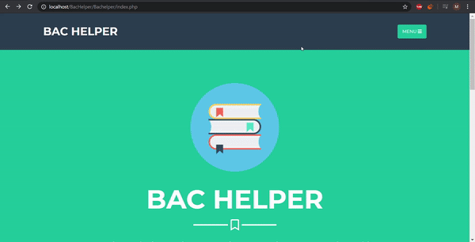

# BacHelper



Demo :  <https://catalin99.000webhostapp.com/bachelper/>

# Description

This website aims to offer an intuitive and easy way for students to prepare for the baccalaureat.

It also provide an editor to let anyone to contibute to the creation process of the lessons and chapters of a topic.

## About this project

I created this project before starting my univeristy studies. It was a real challenge to make a website without having any prior knowledge.

So I made this pretty simple, without frameworks or fancy stuff, only jQuery and bootstrap on the frontend and PHP + MySQL on the backend.

## Edit mode

This was the heaviest part of this project.

Under the hood, the website lessons are dynamically generated pages based on the information received from the autors in the edit mode. Every lesson has its own chapters filled with five type of elements.

- Text area
- Text frame
- Text card
- Function plots
- Images

Check the lesson "How to write your own lesson" to understand their functionalities. 


# Installation

## Localhost using XAMPP

1. Install XAMPP on your machine

2. Clone this repository to `PATH/htdocs` where PATH = your XAMPP installation folder.

3. Open `localhost/phpmyadmin` on your browser, create a new database entry with a given name (let assume that is named DB_NAME) and then import `bachelper.sql` from the repository.

4. Go to your folder in the `PATH/htdocs` and change the file `mysql.php` from the `includes` directory. Change these line according to your credentials: 

```PHP
public static $MYSQL_HOST = "localhost";
public static $MYSQL_USER = "root";
public static $MYSQL_PASSWORD = "";
public static $MYSQL_DB = "bachelper";
```

5. Start XXAMP Control Panel and Start `Apache` and `MySQL`.

6. Open `localhost/YOUR_FOLDER_NAME/index.php` where `YOUR_FOLDER_NAME` is the folder name in the `htdocs`

7. Everything should be good after these steps. If you haven't managed to install corectly, search on google `how to locally host a website using XAMPP`.
